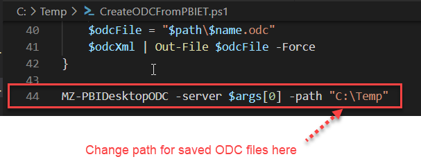
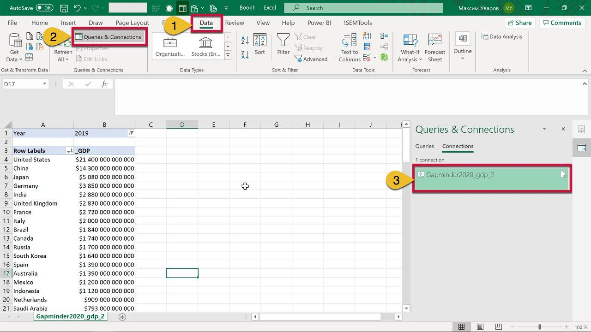
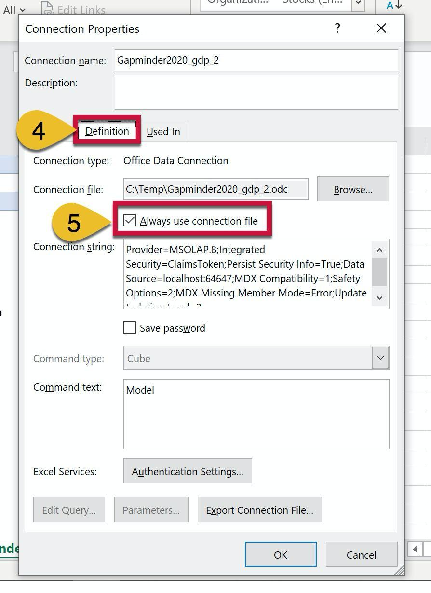

# Create ODC file for currently opened PBIX file

## Purpose

This External Tool allows you to create OR update an ODC (Office Data Connection) file for currently opened PBIX file. 
ODC file will be created with the name of the PBIX file and will contain the server address and port, provided by Power BI Desktop External Tools feature.

You then can open this ODC fie in Excel and build pivot tables for testing your model.

Basically, when you close and re-open PBIX file in the Power BI Desktop, new port will be assigned to the current instance. So, if you want to continue to use previously created Excel file with connection to the same PBIX, you need to change port in connection settings.

To avoid manual seeking for the current port and editing connection settings, you just need to run this External Tool again to overwrite existing ODC for this PBIX with the new server address.

Then you can simple refresh connection in Excel file and continue to use it.

## Installation
### Default installation
You need to download two files: `CreateODCFromPBIET.ps1` and `MZExcelLink.pbitool.json` from repository. By default the new ODC files will be created in `C:\Temp`
1. Download `CreateODCFromPBIET.ps1` and place it in the `C:\Temp`.
2. Download `MZExcelLink.pbitool.json` and place it in `C:\Program Files (x86)\Common Files\Microsoft Shared\Power BI Desktop\External Tools` for 64-bit environment or in `%commonprogramfiles%\Microsoft Shared\Power BI Desktop\External Tools` for 32-bit environment, following the instructions from [official documentation](https://docs.microsoft.com/en-us/power-bi/create-reports/desktop-external-tools#how-to-register-external-tools).

### Change ODC files path 

To set the desired folder path for the ODC files, open ```CreateODCFromPBIET.ps1``` in any text editor and change desired path at the end of the **LAST LINE** of this file:
 
`MZ-PBIDesktopODC -server $args[0] -path "C:\Temp"`

You can change `C:\Temp` to any desired path where you want to save ODC files



### Change script path

Open `MZExcelLink.pbitool.json` in any text editor and in the `arguments` section change the path where you saved `CreateODCFromPBIET.ps1`:

`"arguments": "C:/temp/CreateODCFromPBIET.ps1 \"%server%\" \"%database%\"",`

Please use `/` instead of `\` in the path string. Do not change the rest of this line!


### Allow PowerShell scripts
You may need to allow PowerShell scripts on your PC. To do this, you need to set appropriate PowerShell policy accroding to [this article](https://docs.microsoft.com/en-gb/powershell/module/microsoft.powershell.core/about/about_execution_policies).
1. Type `powershell` in the Windows Search panel and run PowerShell
2. Enter the next command in PowerShell window: `Set-ExecutionPolicy -ExecutionPolicy Unrestricted -Scope CurrentUser` or `Set-ExecutionPolicy -ExecutionPolicy RemoteSigned -Scope CurrentUser`. Select the appropriate policy according to the [documentation](https://docs.microsoft.com/en-gb/powershell/module/microsoft.powershell.core/about/about_execution_policies).
3. You may need the Admin rights to set this policy.

## Using External Tool
1. Open PBIX file in the Power BI Desktop (you may need to reopen it if file was opened during tool installation)
2. On the External Tool ribbon, press "Create ODC" button. ODC file will be created in `C:\Temp` (or in the other folder, if you changed it) with the name of PBIX file
3. Double-click ODC file to open it in Excel.
4. In Excel, confirm opening the file and start creating your pivot tables.

To make this connection semi-stable:

5. In Excel, go to Data -> Existing Connections (or Queries & Connections), right-click on the connection name and select "Change"



6. On the *`Definition`* tab of *`Connection Properties`* window, check "Always use connection file".



7. Save the Excel file.

Now you can continue your work in Excel file, connected to the current instance of Power BI Desktop. Connection will keep until you close PBIX file and/or Power BI Desktop.

If you need to interrupt your work, you can close your saved Excel file and PBIX file.

**To re-establish connection**, you need to perform the next steps **in this order**:
1. Open PBIX file
2. Run "Create ODC" from the "External Tools" ribbon.
3. Open saved Excel file and press "Data" -> "Refresh all" button.
4. You can continue to work until PBIX file is opened

## Cautions
* If you open saved Excel file and try to refresh connection when corresponding PBIX file is **not opened** in Power BI Desktop, you'll get an error.
* If you open saved Excel file and try to refresh connection when corresponding PBIX file is **opened** in Power BI Desktop, but you didn't run the "Create ODC" External Tool, you'll get an error.
* This External Tool provided AS-IS. Use it on your own risk
